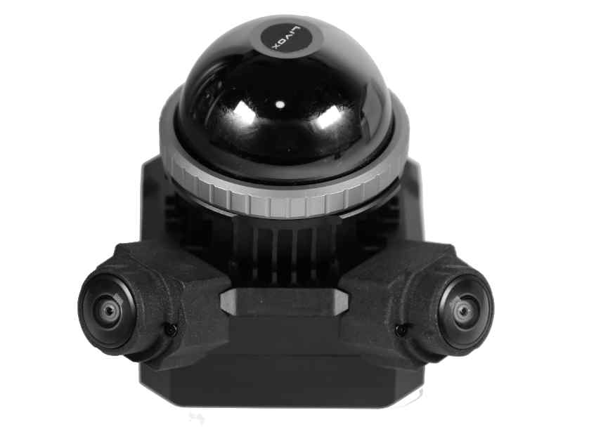
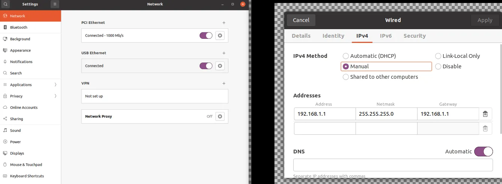
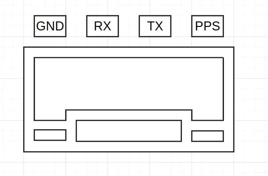

## 售后支持请添加微信

微信号：ShiYuan_Seeker

需要技术支持麻烦添加下客服微信，淘宝等平台不允许提供第三方联系方式，请不要再淘宝问技术支持相关问题，一律不回也不做任何技术支持




# <font style="color:rgb(13,13,13);background-color:rgb(255,255,254);">免责声明</font>
<font style="color:rgb(13,13,13);background-color:rgb(255,255,254);">本文档提供有关深圳市视元智能科技有限公司的产品信息，未以明示</font><font style="color:rgb(13,13,13);">  </font><font style="color:rgb(13,13,13);background-color:rgb(255,255,254);">或暗示，或以禁止发言或其他方式授予任何知</font><font style="color:rgb(13,13,13);background-color:rgb(255,255,254);">识产权许可。本文档所陈述</font><font style="color:rgb(13,13,13);"> </font><font style="color:rgb(13,13,13);background-color:rgb(255,255,254);">的产品文本及相关软件版权均属深圳市视元智</font><font style="color:rgb(13,13,13);background-color:rgb(255,255,254);">能科技有限公司所有，其产</font><font style="color:rgb(13,13,13);"> </font><font style="color:rgb(13,13,13);background-color:rgb(255,255,254);">权受国家法律绝对保护，未经本公司授权，其</font><font style="color:rgb(13,13,13);background-color:rgb(255,255,254);">他公司、单位、代理商及个</font><font style="color:rgb(13,13,13);"> </font><font style="color:rgb(13,13,13);background-color:rgb(255,255,254);">人不得非法使用和拷贝，否则追究相关责任。</font><font style="color:rgb(13,13,13);background-color:rgb(255,255,254);">深圳市视元智能科技有限公</font><font style="color:rgb(13,13,13);"> </font><font style="color:rgb(13,13,13);background-color:rgb(255,255,254);">司保留在任何时候修订本用户手册且不需要通知的权利。</font>

<font style="color:rgb(13,13,13);background-color:rgb(255,255,254);">在订购产品之前，请您与深圳市视元智能科技有限公司联系，获取最</font><font style="color:rgb(13,13,13);"> </font><font style="color:rgb(13,13,13);background-color:rgb(255,255,254);">新的规格说明。</font>

<font style="color:rgb(13,13,13);background-color:rgb(255,255,254);">深圳市视元智能科技有限公司保留所有权利。</font>

<font style="color:rgb(13,13,13);background-color:rgb(255,255,254);"></font>


# <font style="color:rgb(0,0,0);">版本历史</font>
**<font style="color:rgb(0,0,0);"></font>**

| <font style="color:rgb(0,0,0);">版本</font> | <font style="color:rgb(0,0,0);">日期</font> | <font style="color:rgb(0,0,0);">更改点</font> |
| :---: | :---: | :---: |
| <font style="color:rgb(0,0,0);">V1.0</font> | <font style="color:rgb(0,0,0);">2024/07/31</font> | <font style="color:rgb(0,0,0);">产品发布，创建文档</font> |
| <font style="color:rgb(0,0,0);"></font> | <font style="color:rgb(0,0,0);"></font> | <font style="color:rgb(0,0,0);"></font> |
| <font style="color:rgb(0,0,0);"></font> | <font style="color:rgb(0,0,0);"></font> | <font style="color:rgb(0,0,0);"></font> |


## <font style="color:rgba(0, 0, 0, 0.9);background-color:rgb(252, 252, 252);">产品概述</font>
<font style="color:rgba(0, 0, 0, 0.9);background-color:rgb(252, 252, 252);">本产品基于</font>**<font style="color:rgba(0, 0, 0, 0.9);background-color:rgb(252, 252, 252);">Livox Mid-360激光雷达</font>**<font style="color:rgba(0, 0, 0, 0.9);background-color:rgb(252, 252, 252);">与</font>**<font style="color:rgba(0, 0, 0, 0.9);background-color:rgb(252, 252, 252);">双全局曝光鱼眼相机（2个1920x1200@10hz）</font>**<font style="color:rgba(0, 0, 0, 0.9);background-color:rgb(252, 252, 252);">深度融合，实现</font>**<font style="color:rgba(0, 0, 0, 0.9);background-color:rgb(252, 252, 252);">硬件级时钟同步</font>**<font style="color:rgba(0, 0, 0, 0.9);background-color:rgb(252, 252, 252);">（ns级对齐），专为智能移动机器人、高精度SLAM、三维重建等场景设计。系统通过统一时钟源输出时空对齐的激光点云与图像数据，解决多传感器时空偏差问题，提升环境感知精度。</font>

## <font style="color:rgba(0, 0, 0, 0.9);background-color:rgb(252, 252, 252);">技术规格</font>
| **<font style="background-color:rgb(252, 252, 252);">组件</font>** | **<font style="background-color:rgb(252, 252, 252);">参数</font>** |
| :---: | :---: |
| **<font style="background-color:rgb(252, 252, 252);">激光雷达</font>** | <font style="background-color:rgb(252, 252, 252);">Livox Mid-360：4线非重复扫描，水平360°×垂直59° FOV，测距0.1m–40m（10%反射率）</font> |
| **<font style="background-color:rgb(252, 252, 252);">重量</font>** | <font style="background-color:rgb(252, 252, 252);">244g</font> |
| **<font style="background-color:rgb(252, 252, 252);">点云输出</font>** | <font style="background-color:rgb(252, 252, 252);">20万点/秒</font> |
| **<font style="background-color:rgb(252, 252, 252);">IMU输出</font>** | <font style="background-color:rgb(252, 252, 252);">内置6轴IMU（3轴加速度计+3轴陀螺仪），200Hz频率输出</font> |
| **<font style="background-color:rgb(252, 252, 252);">鱼眼相机</font>** | <font style="background-color:rgb(252, 252, 252);">双全局曝光传感器，合并图像分辨率1920×2400 10Hz频率JPEG输出</font> |
| **<font style="background-color:rgb(252, 252, 252);">时钟同步</font>** | <font style="background-color:rgb(252, 252, 252);">雷达与相机硬件时间同步，对齐精度≤100ns（基于PPS信号触发）</font> |
| **<font style="background-color:rgb(252, 252, 252);">物理尺寸</font>** | <font style="background-color:rgb(252, 252, 252);">约60mm × 60mm × 75mm（主体结构）</font> |
| **<font style="background-color:rgb(252, 252, 252);">电源输入</font>** | <font style="background-color:rgb(252, 252, 252);">12V（XT30接口），过压需外接降压模块（可以使用3S电池供电）</font> |
| **<font style="background-color:rgb(252, 252, 252);">通信接口</font>** | <font style="background-color:rgb(252, 252, 252);">USB3.0（RNDIS以太网）（图像数据和雷达数据）</font> |
| **<font style="background-color:rgb(252, 252, 252);">数据输出</font>** | <font style="background-color:rgb(252, 252, 252);">同步点云（含IMU）（Livox-SDK2） + 双目JPEG图像（TCP/Websocket）</font> |


## <font style="color:rgba(0, 0, 0, 0.9);background-color:rgb(252, 252, 252);">应用场景</font>
+ **<font style="color:rgba(0, 0, 0, 0.9);background-color:rgb(252, 252, 252);">机器人导航</font>**<font style="color:rgba(0, 0, 0, 0.9);background-color:rgb(252, 252, 252);">：融合点云与图像实现动态避障（如提取前方2m内点云密度触发悬停</font>**<font style="background-color:rgb(252, 252, 252);"></font>**<font style="color:rgba(0, 0, 0, 0.9);background-color:rgb(252, 252, 252);">）。</font>
+ **<font style="color:rgba(0, 0, 0, 0.9);background-color:rgb(252, 252, 252);">三维重建</font>**<font style="color:rgba(0, 0, 0, 0.9);background-color:rgb(252, 252, 252);">：时空对齐数据提升RGB-D点云着色精度（参考FAST-LIVO2方案）。</font>

## <font style="color:rgba(0, 0, 0, 0.9);background-color:rgb(252, 252, 252);">时钟同步技术</font>
+ **<font style="color:rgba(0, 0, 0, 0.9);background-color:rgb(252, 252, 252);">原理</font>**<font style="color:rgba(0, 0, 0, 0.9);background-color:rgb(252, 252, 252);">：</font>
    - **<font style="color:rgba(0, 0, 0, 0.9);background-color:rgb(252, 252, 252);">雷达端</font>**<font style="color:rgba(0, 0, 0, 0.9);background-color:rgb(252, 252, 252);">：通过</font>**<font style="color:rgba(0, 0, 0, 0.9);background-color:rgb(252, 252, 252);">PPS脉冲信号</font>**<font style="color:rgba(0, 0, 0, 0.9);background-color:rgb(252, 252, 252);">（1Hz，上升沿触发）和</font>**<font style="color:rgba(0, 0, 0, 0.9);background-color:rgb(252, 252, 252);">GPRMC时间报文</font>**<font style="color:rgba(0, 0, 0, 0.9);background-color:rgb(252, 252, 252);">（串口传输）锁定GPS时间基准，持续累加时间戳</font>**<font style="background-color:rgb(252, 252, 252);"></font>**<font style="color:rgba(0, 0, 0, 0.9);background-color:rgb(252, 252, 252);">。</font>
    - **<font style="color:rgba(0, 0, 0, 0.9);background-color:rgb(252, 252, 252);">相机端</font>**<font style="color:rgba(0, 0, 0, 0.9);background-color:rgb(252, 252, 252);">：发送PPS信号给雷达端，使用相同时钟源触发相机曝光。</font>

## <font style="color:rgba(0, 0, 0, 0.9);background-color:rgb(252, 252, 252);">使用教程</font>
<font style="color:rgba(0, 0, 0, 0.9);background-color:rgb(252, 252, 252);">代码位置：</font>

[https://gitee.com/nochain/lidar_s1.git](https://gitee.com/nochain/lidar_s1.git)

### <font style="color:rgba(0, 0, 0, 0.9);background-color:rgb(252, 252, 252);">步骤1：硬件连接</font>
1. <font style="color:rgba(0, 0, 0, 0.9);background-color:rgb(252, 252, 252);">电源接入XT30接口（12V DC）。</font>
2. <font style="color:rgba(0, 0, 0, 0.9);background-color:rgb(252, 252, 252);">USB 3.0连接主机，识别RNDIS虚拟网卡。</font>

### <font style="color:rgba(0, 0, 0, 0.9);background-color:rgb(252, 252, 252);">步骤2：网络配置</font>
#### <font style="color:rgba(0, 0, 0, 0.9);background-color:rgb(252, 252, 252);">方法1</font>
在Setting->network选项卡->usb ethenet->齿轮->IPV4按照如下设置：



然后点击开关重新连接。

#### <font style="color:rgba(0, 0, 0, 0.9);background-color:rgb(252, 252, 252);">方法2</font>
**<font style="color:rgba(0, 0, 0, 0.9);background-color:rgb(252, 252, 252);">如果每次连接都成为一个新连接，IP地址配置没作用，可以使用下面的方法：</font>**

```plain
1. 增加规则，直接运行下面命令即可
sudo bash -c 'echo ACTION==\"add\", SUBSYSTEM==\"net\", \
ATTRS{idVendor}==\"2207\", ATTRS{idProduct}==\"0000\", \
NAME=\"lidars1\" > /etc/udev/rules.d/99-lidars1-net.rules'

2. 设置网络接口，直接运行下面命令即可
sudo nmcli con add type ethernet con-name "lidars1" \
ifname lidars1 \
-- ipv4.addresses 192.168.1.1/24 \
ipv4.gateway 192.168.1.254 \
ipv4.method manual connection.autoconnect yes
```

### <font style="color:rgba(0, 0, 0, 0.9);background-color:rgb(252, 252, 252);">步骤3：设备驱动与数据获取</font>
1. **<font style="color:rgba(0, 0, 0, 0.9);background-color:rgb(252, 252, 252);">激光雷达</font>**<font style="color:rgba(0, 0, 0, 0.9);background-color:rgb(252, 252, 252);">：</font>

```plain
cd /tmp
git clone https://github.com/Livox-SDK/Livox-SDK2.git
cd ./Livox-SDK2/
mkdir build
cd build
cmake .. && make -j
sudo make install

mkdir -p ~/catkin_ws_lidar/src
cd ~/catkin_ws_lidar/src
git clone https://github.com/Livox-SDK/livox_ros_driver2.git
cd livox_ros_driver2

ros1：
./build.sh ROS1
或者ros2
./build.sh ROS2
```

```plain
# 扫描雷达IP  
nmap -sP 192.168.1.1/24
Nmap scan report for a-desktop (192.168.1.1)
Host is up (0.00055s latency).
Nmap scan report for 192.168.1.2
Host is up (0.0056s latency).
Nmap scan report for 192.168.1.175
Host is up (0.0056s latency).

其中192.168.1.1是电脑的IP地址
192.168.1.2是图像的IP地址

说明雷达IP地址是192.168.1.175
修改文件

gedit ~/catkin_ws_lidar/src/livox_ros_driver2/config/MID360_config.json 
修改cmd_data_ip push_msg_ip  point_data_ip imu_data_ip都为192.168.1.1
修改lidar_configs里面的ip为 192.168.1.175

source ~/catkin_ws_lidar/devel/setup.bash

roslaunch livox_ros_driver2 rviz_MID360.launch
```

2. **<font style="color:rgba(0, 0, 0, 0.9);background-color:rgb(252, 252, 252);">鱼眼相机</font>**<font style="color:rgba(0, 0, 0, 0.9);background-color:rgb(252, 252, 252);">：</font>

```plain
mkdir -p ~/catkin_ws_lidar/src
cd ~/catkin_ws_lidar/src
git clone https://gitee.com/nochain/lidar_s1.git  
cd ~/catkin_ws_lidar/

ros1编译运行:

catkin_make
roslaunch lidars1 lidars1.launch

或者ros2编译运行:

colcon build
ros2 launch lidars1 lidars1.launch.py
```

**<font style="background-color:rgb(252, 252, 252);">备注</font>**<font style="background-color:rgb(252, 252, 252);">：完整代码库与配置示例见 </font><font style="background-color:rgb(252, 252, 252);">livox_ros_driver2</font><font style="background-color:rgb(252, 252, 252);"> 和 </font><font style="background-color:rgb(252, 252, 252);">lidar_s1</font><font style="background-color:rgb(252, 252, 252);">。</font>

## <font style="color:rgba(0, 0, 0, 0.9);background-color:rgb(252, 252, 252);">高级：</font>
### 同步接口

todo



### <font style="color:rgba(0, 0, 0, 0.9);background-color:rgb(252, 252, 252);">数据输出格式</font>
 1. <font style="color:rgba(0, 0, 0, 0.9);background-color:rgb(252, 252, 252);">WebSocket（端口9090）：实时推送JPEG图像流 + 同步时间戳，可以使用roslibpy或roslib.js 读取，内部发送方式如下：</font>

```plain
json_msg["op"] = "publish";
json_msg["topic"] = "/image_stitch/image_raw/compressed";
json_msg["msg"] = {
    {"header", {
        {"seq", img->header.seq},
        {"stamp", {
            {"secs", img->header.stamp.sec},
            {"nsecs", img->header.stamp.nsec}
        }},
        {"frame_id", img->header.frame_id}
    }},
    {"format", img->format},
    {"data", ::base64_encode(&img->data[0], static_cast<size_t>(img->data.size()))}
};
```

 2. <font style="color:rgba(0, 0, 0, 0.9);background-color:rgb(252, 252, 252);">TCP（端口8888）：原始数据读取，请查看代码细节deserializeROSMessage函数实现</font>


## 售后支持请添加微信

微信号：ShiYuan_Seeker


